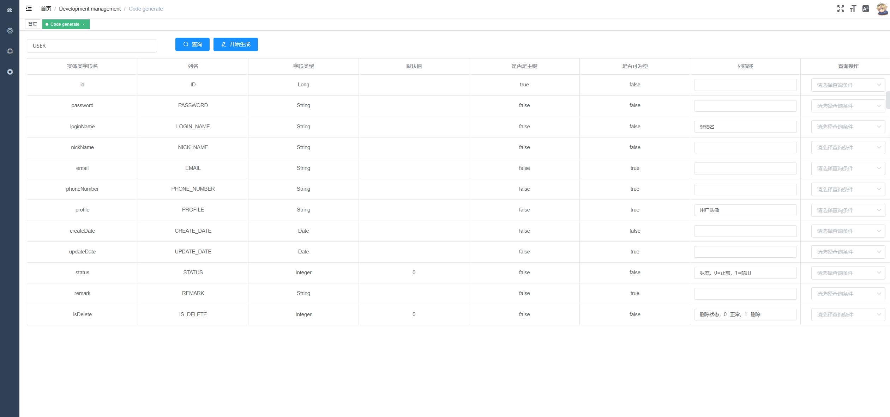
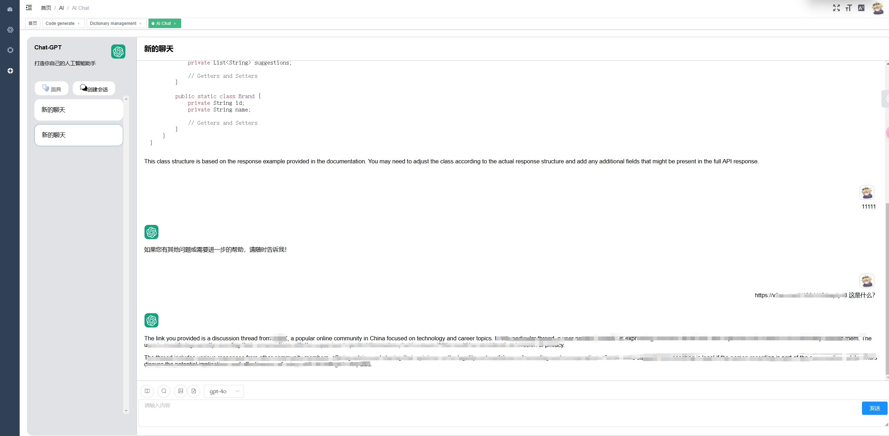
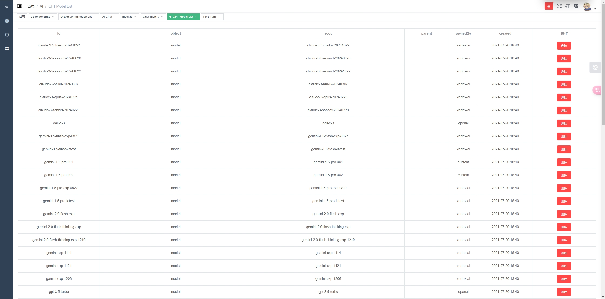

# SHIR-BOOT-ADMIN

For the backend part, please visit: [Shir-Boot](https://github.com/reinershir/Shir-Boot)


# Getting started
```bash
# clone the project
git clone https://github.com/reinershir/Shir-Boot-Admin

# enter the project directory
cd shir-boot-admin

# install dependency
npm install

# develop
npm run dev
```

# Preview






